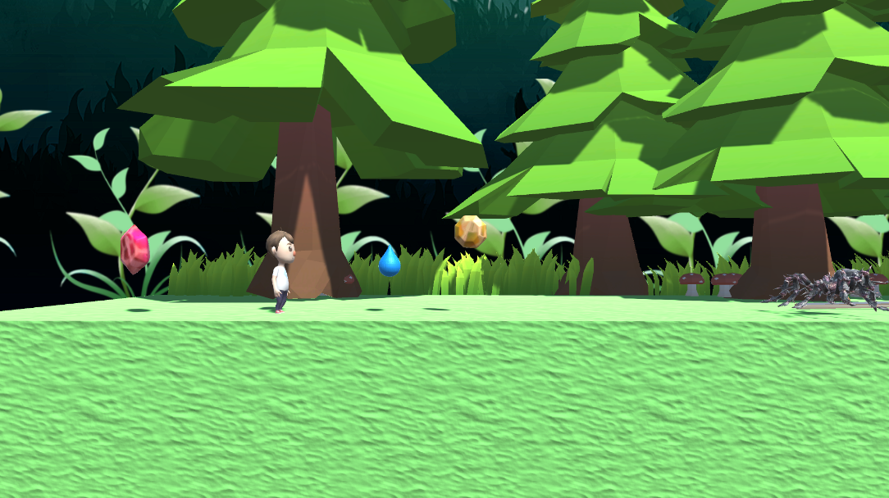
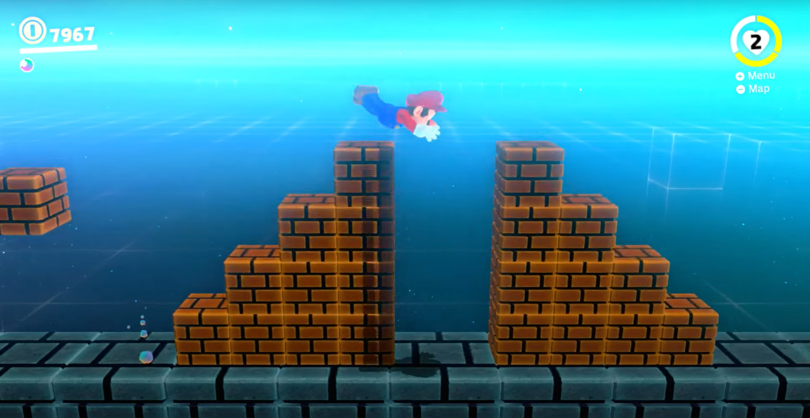
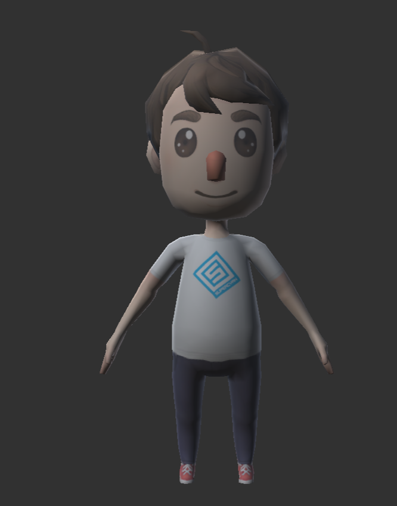
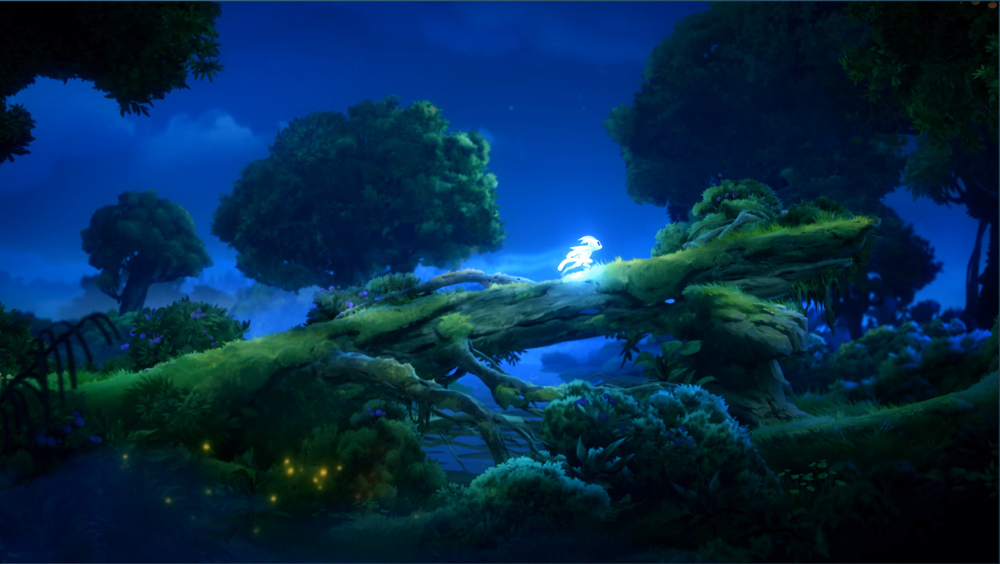
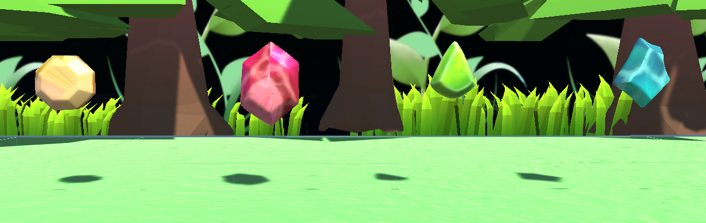
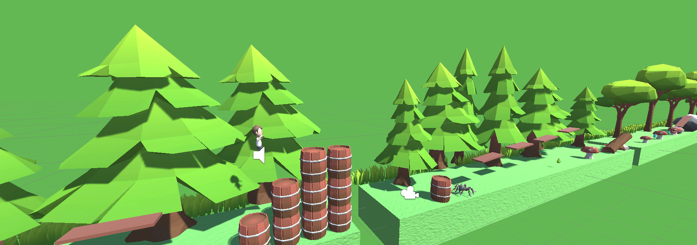
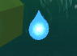
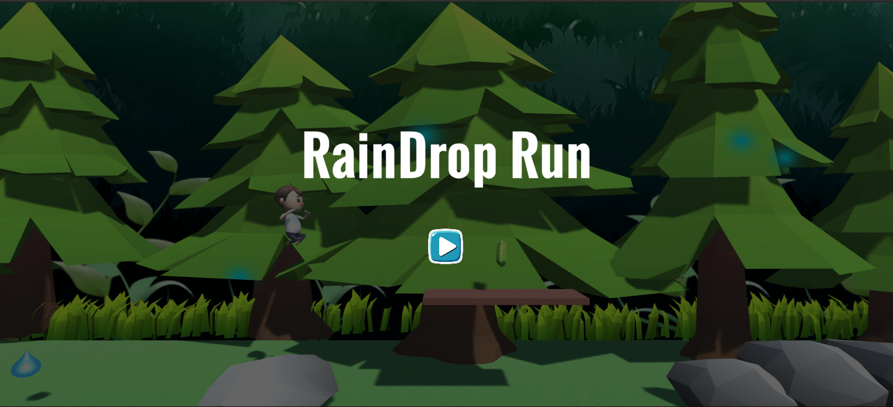
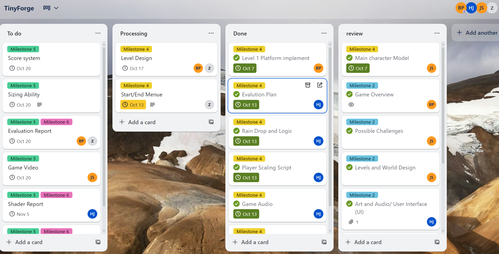

# Game Design Document (GDD)
**Raindrop Run**  
### Table of contents

- [Introduction 🌧️](#introduction-)
- [Story and Narrative 🐞](#story-and-narrative-)
- [Art and Audio 🎨](#art-and-audio-)
- [References](#references)

### Introduction 🌧️

**Core Concept:** Raindrop Run is a 2.5D platform runner viewed from a third-person perspective. The player controls a shrunken human trying to reach shelter during a heavy rainstorm. :running_man: :running_man:

  
   
  <em>Screen shot from Rain Drop</em>

**Genre:** 2.5D Action / Puzzle Runner (platformer with survival and size-changing mechanics).

**Target Audience:** Casual and mid-core players (ages 12–40) who enjoy fast-paced reflex challenges with creative mechanics. Inspired by titles like Grounded, Mario Odyssey and Little Nightmares.

**Unique Selling Points (USPs)**  

- 2.5D miniature backyard world: From grasslands to the house entrance, each stage has its own style.  

- Size-shifting mechanic: Strategic choice of when to grow or shrink by interacting with raindrops.  

- Accessible yet deep: Easy controls, but hard passing.  

- Replayability: Score system and multiple solutions depending on size choice.  

  
   
  <em>Inspired Perspective in Mario Odyssey</em>

### Story and Narrative 🐞

**Backstory:** On a rainy afternoon, our young protagonist mysteriously shrinks to the size of an insect in their backyard. What was once a familiar and safe space suddenly transforms into a hostile world where every raindrop can mean life or death. The main conflict is survival: reaching the safety of the house.

  
   
  <em>Inspired by <b>Grounded</b></em>

**Narrative Progression**
The journey is a desperate escape, with each stage bringing the protagonist closer to safety:

:seedling:Grassland:
The adventure begins among towering blades of grass that loom like a vast forest canopy. In this stage, the player would first feels the weight of the storm which is harmless-looking. It is the first lessons of survival are learned.

:droplet:Stormy night:
As the rain intensifies, the protagonist discovers that by collecting different gems can help him to get to his house easier. Sometimes he needs shrinking to jump to higher platforms, sometimes growing to resist the coming spiders.

:ant:Insects & Garden Tools:
Since the sizing happened, the insects and garden tools become dangerous to protagonist, which may take the life of him. 

:cloud_with_lightning_and_rain:House Entrance: The storm reaches its climax. Each steps of the stair to the house now stretch like a mountain slope. Lightning flashes across the sky as the protagonist makes their final desperate sprint. Reaching the door means salvation, but every drop threatens to end the journey.

**Characters**
The Player (Protagonist):
A shrunken human [child/teen]. Innocent, curious, and resourceful. Their only motivation: survive the storm and return to normal.

:lady_beetle:Companion:
A ladybug may appear briefly to guide or hint at safe paths, reinforcing the sense of scale and danger.

  
   
  <em>Character model rendering</em>

### Gameplay and Mechanics ⚙️

**Player Perspective** 
The game is presented in 2.5D side-scrolling view with a fixed camera.
The player character is always visible on-screen, shown as a tiny human figure (simplified cartoon style, 3d model). Their small size emphasizes the “miniature” theme, making raindrops appear large in comparison.

  
   
  <em>Similar The envisioned game style, similar to Ori</em>

**Controls**  
- :arrow_left: / :arrow_right: : A / D  
- :arrow_up: : Space  
- Dash: Shift (short invulnerability, has cd)

**Interaction with the Environment**  
Players interact indirectly with their surroundings — dodging raindrops spiders, and rakes. Jumping through "cliffs", and collects gems.  

**Progression**  
As game goes on, player will meet more insects and raindrops, together with a score goal to achieve.

**Failure Condition**  
Player is hit by a raindrop, spider, or other barrier such as a rake. 
Player falls off a cliff.
Player does not reach the score goal.

**Scoring System**  
Collectible Gems scattered across the level add to the score, encouraging exploration and replayability.  

**Replay Motivation**  
Players aim to improve survival time, achieve higher scores.  

**Gameplay Mechanic**  
Core loop: **Dodge → Run → Collect → Survive**  

- **Raindrop mechanics:**  
 - Dodge the raindrops

- **Diamond mechanics:**  
  - **Yellow Diamond:** Shrinks the character, allowing them to slip through narrow gaps and double jump.  
  - **Red Diamond:** Enlarges the character, slowing movement but granting protection against damage and enabling the character to kill the spider.  
  - **Green Diamond:** 50 points.
  - **Blue Diamond:** 100 points.

  

  
   
  <em>Different Diamond types in RainDrop Run</em>

- **Insects:** Appear in advanced levels as obstacles or mini-bosses (e.g., ants block paths, dragonflies swoop).

  

  
   
  <em>Shrinking example in Game Demo</em>

### Levels and World Design 🍀

**Game World**
The setting is a miniaturized backyard during rainfall.
Gameplay is 2.5D side-scrolling with continuous screen scrolling.
Multiple levels are designed as natural progressions of a storm.
Navigation is straightforward: the player always moves forward (to the right), with optional detours to collect seeds.
Minimap is optional; checkpoints guide progress.
The game scene will be divided into multiple layers, creating a 2.5D effect

  
   
  <em>Platform Rendering Style</em>

**Level 1: Light Rain (Tutorial)** 📖

**Theme:** A calm drizzle in the backyard grass.

**Goal:** Teach players how to move and use sizing ability.

**Design:** Few, slow raindrops. Simple collectibles gems placed along the main path.

**Challenge:** 
- Avoid first raindrops, learn to time jumps.
- Collect **500** points before entering the tent

**End point:** Reach a tent that acts as a checkpoint shelter.

  
   
  <em>Raindrop Run Level 1 Tutorial</em>

**Level 2: Midnight Storm** 🌙

**Theme:** The world is engulfed in darkness, the faint beam from the player’s lantern guide the night road.

**Goal:** Survive through intensified hazards under limited visibility.

**Design:** More frequent raindrops and enemies might cloaked in darkness. Only a moving point light follows the player.

**Challenge:** 
- Be more careful before make movement, use sizing ability wisely.
- Collect **800** points before entering the tent.

End point: Enter the tent as checkpoint.

  
   
  <em>Raindrop Run Level 2</em>

**Level 3: Thunderstorm Finale** 🌩️

**Theme:** A full thunderstorm, the climax of the journey.

**Goal:** Deliver the highest intensity and final escape challenge.

**Design:** Extremely dense raindrops. Random lightning flashes briefly illuminate the screen, creating tension. Multiple insect enemies appear together.

**Challenge:** Maximum difficulty — survival under chaotic conditions.

**End point:** Dash into the crack of a house door, escaping the storm → game clear.

  
   
  <em>Concept image of level 3</em>

### Art and Audio 🎨

**:framed_picture:Art Style**  
- The game will adopt a **cartoon  aesthetic**,featuring bright colors and exaggerated proportions to provide visual clarity and charm.
- The goal is to make the backyard feel **playful yet adventurous**. To achieve this, we exaggerate scale: grass as towering forests, puddles as lakes, and insects as colossal threats.  

**:cyclone:Visual Inspirations**  
- *Ori and the Blind Forest* → palette softness  
- *Grounded* → miniature backyard perspective  
- *Little Nightmares* → atmospheric tension  

**:sparkles:Effects**  
- Raindrops rendered as **semi-transparent, glass-like spheres** with splash animations.  
- Size-changing animations with **smooth scaling**.  

  
   
  <em>Raindrop in Game</em>

**:speaker:Audio Design**  
- Unique audio cue for size change (**pitch-shifting swoosh**).
- Unique audio cur for jump.
- Background music: **dynamic, calm but urgent**, escalating with storm intensity.  

**Assets**  
- Backgrounds and sprites: **hand-drawn digital art** or sourced from free libraries.  
- Player, raindrops, insects, and obstacles designed as **2D sprites with consistent outlines**.  
- Sound effects sourced from **Freesound.org** and refined in **Audacity**.  

### 🧩 User Interface (UI)

#### UI Elements
- **Top: Score**
  - Displays the player’s collected **Diamonds** and total points.
- **Pop-ups on Size Change**
  - Brief leaf-framed notification showing **“Grown!”** or **“Shrunk!”** with a subtle ripple animation.
    
**UI Style**
- Fantasy/nature kit vibes with **soft watercolor textures**.
- Organic, irregular borders (avoid sharp or metallic edges).
  
**Menus**
- **Main Menu:** Wooden-plank buttons with hand-painted text — *Start, Options, Exit*.
- **Ending Menu:** Smaller plank-style buttons — *Restart, Exit*.
- **Options:** Vine-shaped sliders for Music/SFX volume.
  
**Feedback**
- On hit, player died directly with audio feedback and ending menu pop up. 
- On size change, different audio feedbacks pop up to help player to identify.

  
   
  <em>Start Menu in Game Demo</em>

### Technology and Tools ⚒️  

Our project will be developed using **Unity 2022.x (2D mode, WebGL build)** as the core game engine, chosen for its stability, compatibility, and suitability for browser-based delivery. For version control, we will rely on **GitHub**, which allows efficient collaboration, change tracking, and smooth integration with our development workflow. To support the creative process, **AI art tools** such as *Stable Diffusion* and *MidJourney* will be used to generate concept art and visual assets, which will then be refined for stylistic consistency. For audio, we will use a combination of **Audacity** for editing, **Freesound** as a source of open audio samples, and AI generation for additional sound assets where appropriate. To coordinate project management, we will use **Trello** or **Notion** to assign tasks, track milestones, and ensure accountability across the team.  

### Team Communication, Timelines and Task Assignment 📅  

Team communication will be conducted primarily through **Discord** (with all discussions held in **English** to ensure clarity and inclusivity), and occasionally supported by social platforms such as Instagram for quick updates. 
**Task assignment and tracking tool:** [TinyForge Trello Board](https://trello.com/b/aRFiKEcN/tinyforge)
**Task timeline toll:** [Tinyforge Jira Timeline](https://graphic-tinyforge.atlassian.net/jira/core/projects/TIN/timeline?rangeMode=weeks)

  
   
  <em>Internal Task Associating</em>

### Possible Challenges 🏆

1. AI-generated art inconsistency
Issue: Different AI prompts may result in mismatched styles.
Solution: Define a unified palette (soft watercolor + diorama style). Use post-processing filters for consistency.

2.Balancing randomness of raindrops
Issue: Pure randomness may feel unfair, but too predictable reduces tension.
Solution: Implement semi-random spawn zones with safe areas, ensuring skill still matters.

3.Performance limitations in WebGL
Issue: Excessive raindrops and particle effects may cause frame drops.
Solution: Cap raindrop count, reuse particle prefabs, optimize with pooling system.

4.Difficulty scaling
Issue: New hazards may overwhelm beginners.
Solution: Introduce mechanics gradually (tutorial → puddles → wind → insects).

5.Team collaboration
Issue: Dividing tasks across programming, art, and audio while staying synchronized.
Solution: Use Trello + GitHub branches; regular check-ins to align progress.

6.Raining Effect
Issue: Adding realistic raining effect and rendering into the game.

### References

- Grounded Pic. https://www.washingtonpost.com/video-games/2020/07/30/accessibility-option-survival-game-grounded-turns-my-arachnophobia-into-thrill/

- Character Model - created by third party AI tools

- Ending Scene pic - created by ChatGPT

### Asset Packages 

- 2D Forest sprite pack: https://assetstore.unity.com/packages/2d/environments/2d-forest-sprite-pack-216237
- Free Low Poly Nature Forest: https://assetstore.unity.com/packages/3d/environments/landscapes/free-low-poly-nature-forest-205742
- (UNL) Ultimate Nature Lite: https://assetstore.unity.com/packages/3d/environments/unl-ultimate-nature-lite-176906
- Spider Model: https://www.aigei.com/item/zhi_zhu_3ds_ma.html
- Rake Model: https://www.aigei.com/item/ba_zi_gong_ju.html
- Diamond Model: https://www.aigei.com/item/bao_shi_shui_3.html
- Raindrop Model: https://www.tripo3d.ai/app/model/8b060747-eab3-48cd-b288-bd454b5bd430
- House Model: https://assetstore.unity.com/packages/3d/environments/landscapes/low-poly-cartoon-mini-pack-free-227405
- Game Sound: https://freesound.org/
- Character Asset: https://assetstore.unity.com/packages/3d/characters/humanoids/character-pack-free-sample-79870
- Character Grow Sound: https://pixabay.com/sound-effects/coin2-340039/
- Character Shrink Sound: https://pixabay.com/sound-effects/pixel-death-66829/
- Character Hit Raindrop Sound: https://pixabay.com/sound-effects/death2-340040/
- 40+ Simple Icons: https://assetstore.unity.com/packages/2d/gui/icons/40-simple-icons-free-171008
- UX Flat Icons: https://assetstore.unity.com/packages/2d/gui/icons/ux-flat-icons-free-202525
- 371 Simple Buttons Pack: https://assetstore.unity.com/packages/2d/gui/icons/371-simple-buttons-pack-97516

