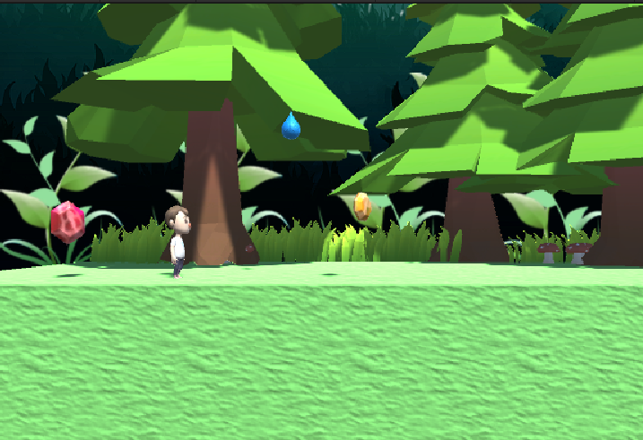
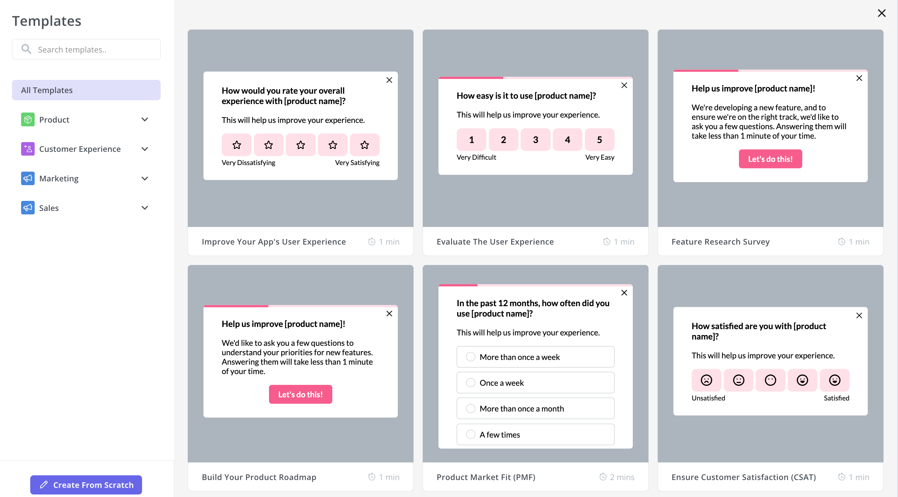
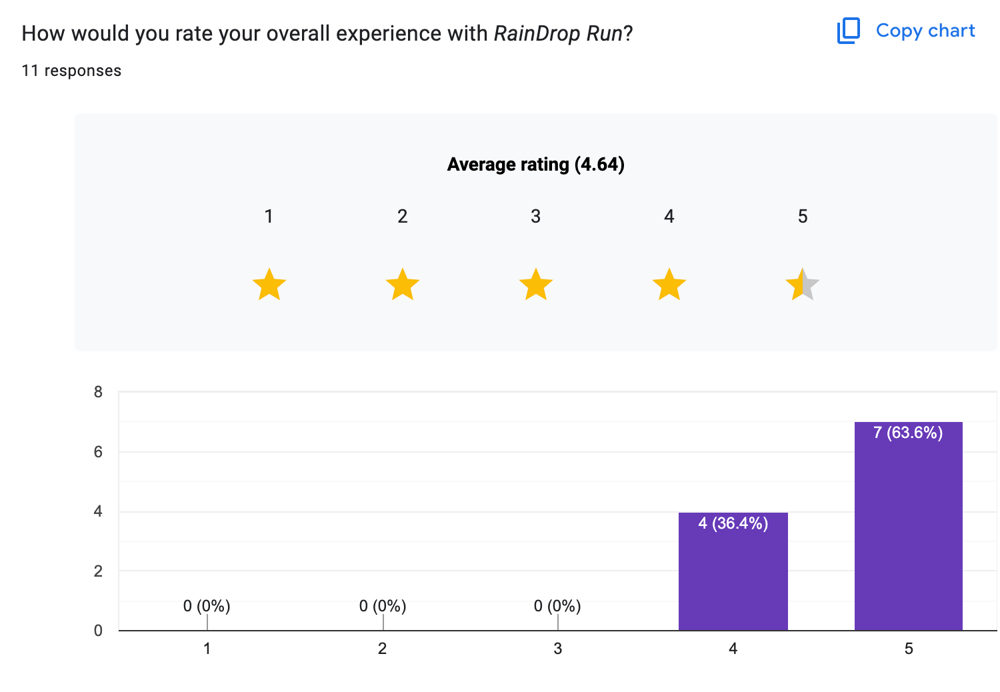
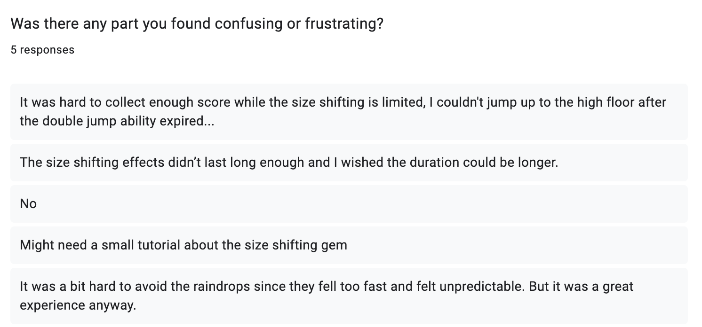
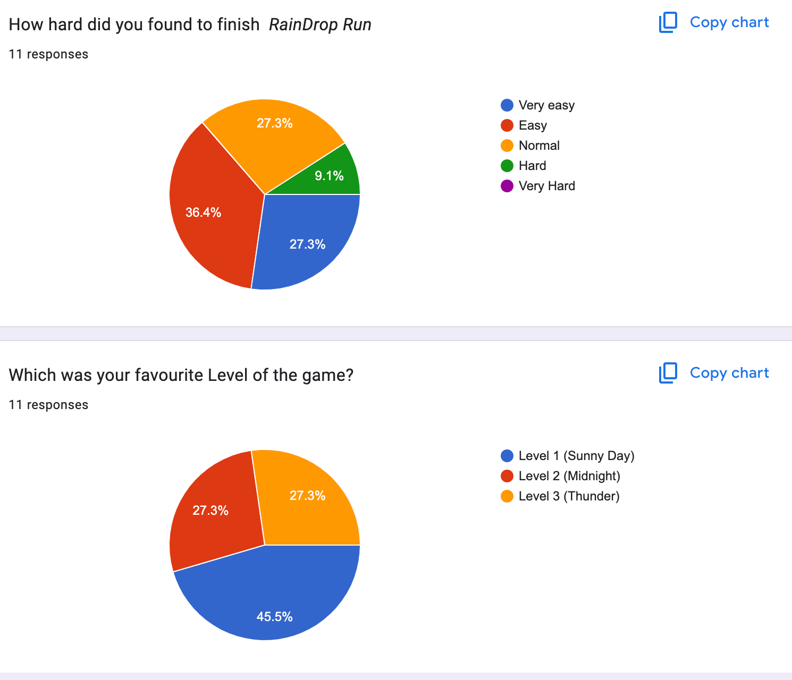
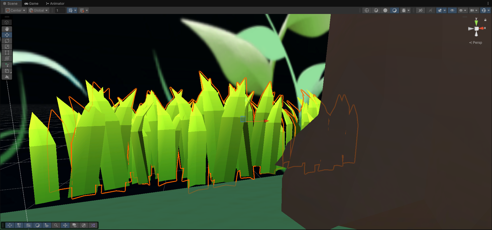
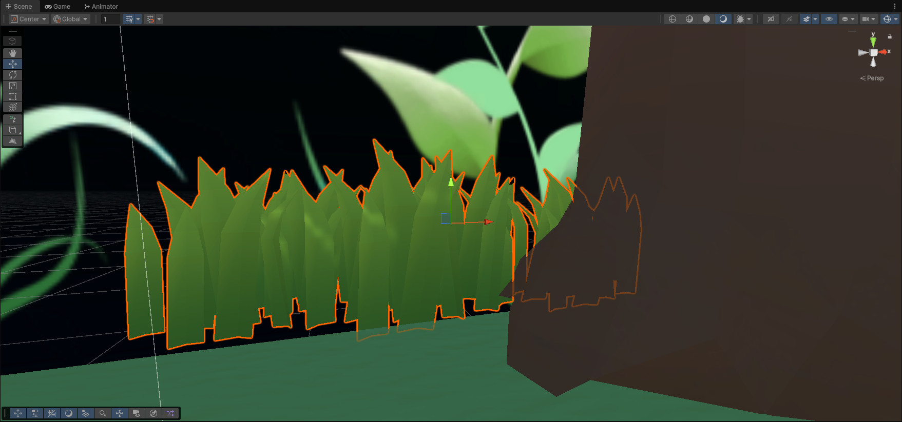
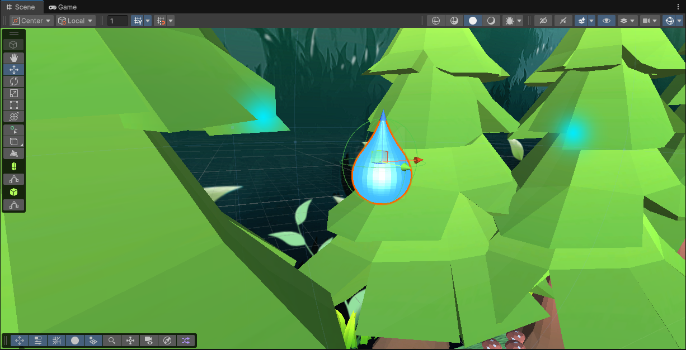
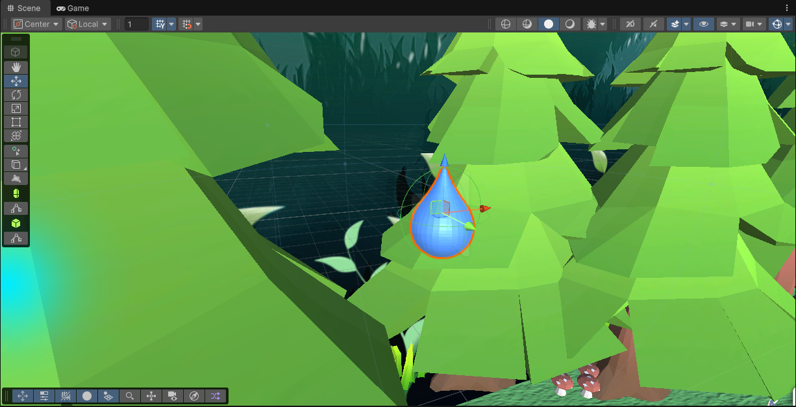
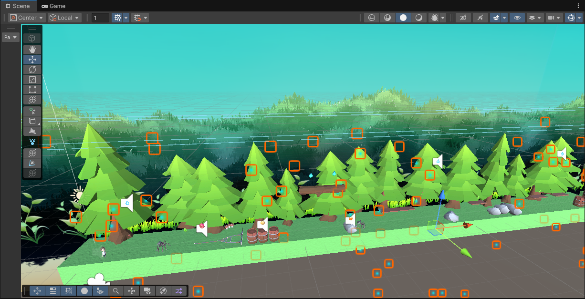

## Table of Contents

- [Evaluation Plan](#evaluation-plan)
- [Evaluation Report](#evaluation-report)
- [Shaders and Special Effects](#shaders-and-special-effects)
- [Summary of Contributions](#summary-of-contributions)
- [References and External Resources](#references-and-external-resources)

## Evaluation Plan

The purpose of this evaluation is to get real feedback from players. In order to achieve that, we will spot problems with usability and visual clarity. These actions will complete before the final submission. We'll also use a mix of observation and questionnaires. These will allow us to make sure that we understand both what players do and why they do it.

---

### 1. Evaluation Techniques

We’ll use two methods to gather both quantitative and qualitative data:

#### Observational Technique: Think-Aloud

**Method:**  
During playtesting, participants will be asked to talk out loud. The main contents are about their thinking and feeling. This includes narrating their decisions and reactions to obstacles and also any confusion they experience. For example, a player might say that “I didn’t see that spider because it blended into the background!” Such comments can help us identify issues. The issues that might not be obvious from  watching the screen. In addition, like unclear controls, confusing level layouts and moments where the difficulty spikes unexpectedly.

**Reason for choosing this method:**  
We chose Think-Aloud because our game involves fast-paced decision-making. This evaluation is based on the player's first reaction to the game. This is the golden time for the game that is only half an hour. In addition, it might be diificlut for us to reveal why they fail or hesitate if we only simply observing players without hearing their thoughts. By listening to their thought process, we can understand players' cognitive challenges.

**Focus:**  
- Check whether controls are intuitive and actions like jumping or dodging can be performed easily.  
- Observe interactions with raindrops and spider obstacles, noting if any are missed due to poor visibility, timing, or confusing placement.  
- Monitor how background elements impact gameplay and whether they distract or confuse players.  
- Record both quantitative metrics and qualitative feedback.  
- Identify frustration points or repeated mistakes that indicate areas needing improvement.

---

#### Querying Technique: Post-Play Questionnaire

**Method:**  
After playing, participants will complete a short survey. Most questions use a 1–5 rating scale to quantify the experience. A few open-ended questions allow participants to explain their ratings or provide suggestions. For example such as “Which obstacle was the hardest to notice?” or “What could make the game more enjoyable?”

**Reason for choosing this method:**  
The questionnaire complements observation by capturing players’ after thoughts. While Think-Aloud reveals what players do and why, the survey gives players a chance to think about the game after finishing playing it. Providing players a  reason to think rationally. For a game like ours, it’s important to know both the objective performance and subjective satisfaction to guide meaningful improvements.

**Focus:**  
- Measure fun and engagement.  
- Understand perceived difficulty and whether obstacles felt fair or frustrating.  
- Evaluate visual clarity, particularly whether raindrops and spiders stand out against the tree background.  
- Assess effectiveness of audio feedback, such as sounds for gem collection or approaching obstacles.  
- Collect qualitative comments to explain player ratings and highlight specific areas for improvement.


---

### Tasks for Participants

Each participant will:

1. Play the game for about 5 minutes. This aims to finish at least one level.  
2. Try to avoid raindrops and spiders. 
3. Speak their thoughts out loud during play.  
4. Complete the 5-minute questionnaire after finishing.

---

### 2. Participants

We’ll have at least 10 participants. It makes sure that each method gets 5 people at minimum.

**Recruitment:**  
We’ll ask students from the University of Melbourne and our friends who are interested in this kind of games via social media. This makes it easier to schedule sessions.

**Selection criteria:**
- Play casual or runner-style games sometimes.  
- Have not worked on the game or seen the code before.

<p align="center">
  
  <br>
  <em>Gameplay Demonstration</em>
</p>

---

### 3. Data Collection

#### Observation Data

- **Notes on behavior:** Moments of confusion, frustration, or hesitation.  
- **Performance data:** How many times players hit raindrops or spiders and how many gems they collect.  
- **Visual/audio feedback:** How well players notice obstacles against the background and how the sounds affect them.

####  Questionnaire Data

**Ratings (1–5 scale):**
- Fun / enjoyment  
- Difficulty  
- Visual clarity
- Audio feedback  
- Overall satisfaction  

**Open-ended questions:**  
- “Were any obstacles hard to see?”  
- “Did the background distract you?”  
- “Any other thoughts or suggestions?”

**Tools:**  
- **Google Forms** for the questionnaire  
- **OBS Studio** or built-in recorder for gameplay  
- Manual notes taken by one observer

<p align="center">
  
  <br>
  <em>Questionnaire Survey templates</em>
</p>

---

### 4. Data Analysis

#### Quantitative

- Calculate average ratings for fun, difficulty and clarity.  
- Check consistency by looking at standard deviation.  
- Compare collision counts and other performance metrics to see if some parts are too hard or too easy.

#### Qualitative

- Go through open-ended answers and observation notes.  
- Group issues into three areas:  
  - Visual clarity  
  - Audio feedback  
  - Difficulty balance  

#### Key Metrics

| Metric | Goal | Measurement |
|--------|------|------------|
| Clarity | Can players easily see obstacles? | Survey ratings & observation notes |
| Difficulty | Is the game challenging but fair? | Survey ratings & collision counts |
| Engagement | Are players enjoying the game? | Survey ratings & observation notes |
| Audio feedback | Do sounds help players notice obstacles and gems? | Survey ratings |

---

### 5. Timeline

We plan to complete everything in 1 week:

| Day | Task | Description |
|------|------|-------------|
| 1-2 | Preparation | Finish test build and check questionnaire clarity |
| 3-5 | Playtesting & Data Collection | Recruit participants, run all observation and survey sessions |
| 6-7 | Data Analysis & Refinement | Analyze results, identify main issues and make improvements before submission |

---

### 6. Team Responsibilities

| Team Member | Responsibilities |
|-------------|-----------------|
| Baimin Pan | Organize and schedule playtesting, manage participants |
| Hongyi Jiang | Run sessions, record gameplay, track collisions |
| Jiaming Song | Prepare and run the survey, export data, basic analysis |
| Zhenjie Gao | Analyze qualitative feedback, document issues and implement improvements |

> All team members will participate in discussions, note-taking and final analysis.

---

### 7. Evaluation Goals

We want to:

- Find usability issues with controls or confusing parts of the game.  
- Check that rain, spider and tree visuals are clear and balanced.  
- See if sounds help players notice gems and obstacles.  
- Make sure the difficulty feels fair and engaging.  
- Get feedback we can actually use to improve the game before submission.


## Evaluation Report

The evaluation of **RainDrop Run** was conducted to gather real user feedback and improve the overall **usability**, **visual clarity**, and **gameplay balance** before final submission. We integret not only what players did, but also why they behaved in certain ways.  

### 1. Methodology  

We recruited **10 participants**: 5 for Think-Aloud sessions and 5 for the post-play questionnaire, who were university students aged 19–25 and occasionally play casual or runner-style games. Each participant played for 5–7 minutes then followed by the questionnaire.  

### 2. Observation Findings (Think-Aloud)  

Participants were asked to speak aloud their thoughts while playing. We recorded gameplay footage and notes:

#### Common issues:
| Issue | Description | Frequency |
|-------|--------------|------------|
| **Raindrops too fast** | Players often got hit unexpectedly and felt it was hard to avoid. | 4/5 |
| **Gem effects too short** | Players noticed the temporary power-up (speed boost/invincibility) ended too quickly. | 3/5 |
| **Background blending** | The spider or raindrop blended into tree textures, making them less visible. | 1/5 |
| **Score limitation** | Players didn’t meet the requirement of the score before they entering next level. | 2/5 |

#### Positive notes:

- Some players can quickly understood movement and controls.  
- Size shifting ability can largly help player to finish the game.  
- Audio feedback in real time.  

### 3. Questionnaire Results

Each player rated five key aspects on a 1–5 scale (1 = very poor, 5 = excellent).  

<p align="center">
  
  <br>
  <em>Experience Rating from player</em>
</p>

| Metric | Avg. Rating |Interpretation |
|--------|--------------|---------------|
| Overall enjoyment| **4.6** |Players found the game fun overall |
| Controlling  | **4.1** |Easy to control |
| Difficulty | **4.0** |Some found it a bit hard |

#### Open-ended feedback examples

<p align="center">
  
  <br>
  <em>Free comment responses from player</em>
</p>

### 4. Data Analysis

<p align="center">
  
  <br>
  <em>Barchart Figures on google form</em>
</p>

#### Quantitative
- Fun and satisfaction scores were high (>4.5), confirming strong engagement.  
- Difficulty and Controlling were mid-range, highlighting improvement opportunities.  

### 5. Game Improvement

#### Summary of Key Findings
| Category | Problem | Planned Improvement |
|-----------|----------|---------------------|
| Visual Clarity | Raindrops & spiders not distinct enough in level 2| Adjust brightness and contrast|
| Difficulty Balance | Too easy to get hit by raindrop| Reduce raindrop speed slightly|
| Gem Duration | Too short | Extend size-shifting ability duration |
| Controlling tutorial | Unclear controlling and ability gem introduction | Add tutorial bar in menu|

#### Game Implement
- **Reduce Rain Drop speed by 15%**
- **Increase sizing ability from 3s to 6s**
- **Increase point light radius by 10% in level 2**
- **Updating tutorial menu pop-up at start menu**

### 6. Conclusion   

Overall, We learned that **even small design issues can strongly affect gameplay experience.** After adjustments, it significantly improved playability and player satisfaction. The evaluation successfully aligned with our initial goals.  

### 7. Tool links

**Questionnaires link:** https://docs.google.com/forms/d/e/1FAIpQLSeRyTo5SfUjK68vLaK1jkyAnnhdKU6yjM4qcKQl3SXatThymg/viewform?usp=header

**Response link:** https://docs.google.com/forms/d/187UJOwe8YtZiHm2z1mLPzlaDjm8U7bnSjx9KqcZr2do/edit#responses

## Shaders and Special Effects

### 1. Custom Shader #1 — WindEffect Shader

**File Path (Git repo link):**  
*https://github.com/feit-comp30019/2025s2-project-2-test-team-1/blob/main/Assets/Shader/WindEffect.shader*  
[Assets/Shaders/WindEffect.shader]

#### Overview
This shader creates a wind-bending effect on grass.  
The movement is computed on the GPU in the vertex shader, reduces animation load on the CPU.

<p align="center">
  
  &nbsp;&nbsp;&nbsp;&nbsp;
  
  <br>
  <em>Comparison of grass before and after shader</em>
</p>

This shader also includes Phong-style lighting, combining diffuse and ambient terms to maintain appearance under lighting.

#### Effect Rationale
The purpose of this shader is to enhance environmental realism by giving static outdoor objects a sense of life and motion. Without wind motion, grass stay static.  
By performing vertex deformation on the GPU, the effect is:
- Efficient(no CPU animation)
- Continuous
- Parameter-controlled

#### Key Features
| Feature | Shader Stage | Description |
|--------|--------------|-------------|
| Vertex bending| Vertex Shader | Uses sine wave + vertex height to simulate wind |
| Adjustable wind strength & speed | Material properties | Allows artistic control inside Unity |
| Ambient + Diffuse lighting | Fragment Shader | Ensures object shading remains consistent with scene lights |
| Shadow attenuation support | Fragment Shader | Allows the object to correctly receive shadows |

#### Representative Code Snippet (Explanation)
The wind effect is applied in the vertex shader:
```c
float windWave = sin(_Time.y * _WindSpeed + v.vertex.x * 2.0) * _WindStrength;
float heightInfluence = v.vertex.y;
worldVertex.x += windWave * heightInfluence;
```

sin(...) creates oscillation
Taller vertices (v.vertex.y) bend more than lower ones, producing a natural swinging motion
The displacement happens before projection so the model appears to sway in world space


### 2. Custom Shader #2 — Raindrop Shader

File Path (Git repo link):
https://github.com/feit-comp30019/2025s2-project-2-test-team-1/blob/main/Assets/Shader/Raindrop.shader
[Assets/Shaders/Raindrop.shader]

#### Overview
This shader creates a dynamic raindrop ripple effects on the raindrop.
This ripples are generated on the GPU. This ensures the lightweight animation performance.

<p align="center">
  
  &nbsp;&nbsp;&nbsp;&nbsp;
  
  <br>
  <em>Comparison of Raindrop before and after shader</em>
</p>

This shader also includes emission and specular lighting. These are used to reproduce reflective water surfaces under lighting.

#### Effect Rationale
The goal of the shader iss to bring visual depth and realism to the real world raindrop.
By performing all ripple calculations in the fragment stage, the system achieves:
- Real-time wave animation
- Parameter-controlled

#### Key Features
| Feature | Shader Stage | Description |
|--------|--------------|-------------|
| Emission lighting | Fragment Shader | Adds subtle glow to brightened areas |
| Specular highlight | Fragment Shader | Simulates reflective wet surface |
| Adjustable parameters | Material properties | Allows artistic control inside Unity |
| Transparent blending | Pipeline | Uses alpha blending for semi-transparent water surfaces |

#### Representative Code Snippet (Explanation)
The function calculate the strength of wave:
```c
float dist = length(worldPos.xz);
float wave = sin(dist * _RippleFrequency - _Time.y * _RippleSpeed);
wave = wave * 0.5 + 0.5;  // Normalize [-1, 1] → [0, 1]
wave *= exp(-dist * _RippleDecay);  // Fade with distance
return wave * _RippleStrength;
```

The brightness is modulated by the intensity of the ripple.

A simple view is also added:
```c
float3 viewDir = normalize(_WorldSpaceCameraPos - i.worldPos);
float spec = pow(max(0.0, dot(normal, viewDir)), 8.0) * _SpecularPower;
col.rgb += spec;
```

Finaly, emission adds a glowing effect. Thos emphasize the wetness and motion under the backgorund.

### 3. Particle System #3 — Rain
File Path (Git repo link):
https://github.com/feit-comp30019/2025s2-project-2-test-team-1/blob/main/Assets/Scripts/RainController.cs
[Assets/Scripts/RainController.cs]

#### Overview
This particle system is used to generate the rainfall effect in Level 1.
It combines a Unity ParticleSystem component with a custom C language script named RainController.cs.

<p align="center">
  
  <br>
  <em>The particle system for rain effect</em>
</p>

The system creates a natural raining experience by modulating the rrain density through time.

#### Effect Rationale
The purpose of this particle system is to simulate realistic and dynamic rain.
By using the particle system, the effect shows:
- Lightweight and scalable
- Dynamic
- Parameter-controlled

#### Key Features
| Feature | Shader Stage | Description |
|--------|--------------|-------------|
| Dynamic emission rate | RainController script | Uses a sine function to modulating the intensity of rain|
| Realistic fall speed | Particle System | Adjusted to physical gravity |
| Small droplet scale | Particle System | Maintains visual realism |

#### Representative Code Snippet (Explanation)
The emission rate is dynamically modulated in real time:
```c
float rainIntensity = (Mathf.Sin(Time.time * 0.5f) + 1f) / 2f;
emission.rateOverTime = baseRate + rainIntensity * 400f;
```

This uses a sine wave to adjust the strength of the rain.


#### Demonstration


## Summary of Contributions

#### Jiaming Song: 
- Organized team design meetings and was responsible for assigning tasks within the group.
- Defined the overall tone of the game and created the first draft of the GDD outline. Later, I took charge of writing the Gameplay and Mechanics, Levels and World Design, and Possible Challenges sections, as well as revising other parts of the GDD.
- Designed the main character. Initially, I tested AI-generated 3D models (Tripo3D), but abandoned them due to material issues. The second version used an AJ (Mixamo) model, but animation files were incompatible with Unity. Finally, I switched to a character model from the Unity Asset Store and set up the character’s Animator, mapping various animation clips correctly.
- Implemented core character logic, including movement (forward/backward/lateral rotation), jumping, and basic death conditions (e.g., being hit by spiders or rakes, falling off cliffs). I also assigned tags, layers, rigid bodies, and other properties to scene objects to ensure the game operated properly.
- Handled local deployment and testing of the game to ensure correct performance, including screen ratio and overall playability.
- Created background music using Suno AI and added jump sound effects using Freesound resources.
- Designed gameplay mechanics for special gems: yellow gem for double jump and red gem for temporary invincibility.
- Completed the windEffect shader.
- Recorded and edited the gameplay video in full.
- Collaborated with Hongyi Jiang to complete the evaluation plan.


#### Hongyi Jiang:
- Writed the Art and Audio part of the first draft of GDD. Help changing different parts of GDD during the developing period.
- Designed and implemented the raindrop visual system. Include the appearance and physical behavior.
- Developed the Raindrop Shader. Created the shader logic for raindrops. Produced dynamic ripple and emission. 
- Designed and implemented the Rain Particle System logic for Level 1. The emission rate dynamically changes through the time runing.
- Created different music when character touches different gems using Freesound resources.
- Created death music when character meeting the death situation using Freesound resources.
- Defined the raindrop placement layout for Level 1. Ensure balanced the distribution and optimal visual.
- Designed and implemented the gem logic system. Ensure different gem types provide unique effects.
- Collaborated with the team on integrating environmental particle effects.
- Collaborated with Jiaming Song to complete the evaluation plan.


#### Zhenjie Gao:
- Designed and implemented Level 2 and Level 3. Carefully balanced platform spacing, obstacle difficulty, and camera transitions to ensure a consistent and engaging player experience across all stages.
- Implemented the gem collision system, optimizing collider detection and refining trigger logic to improve interaction accuracy. 
- Created and implemented the tutorial module, designed to introduce players to movement, jumping, and gem mechanics. 
- Developed the scoring system, which dynamically updates and displays player progress. Used Unity’s TextMeshPro for 
score visualization and implemented data persistence through PlayerPrefs to retain player performance between levels.
- Implemented level transition effects, creating smooth and visually cohesive transitions between scenes. 
- Designed and implemented both victory and death animations.
- Debugged and fixed multiple gameplay issues identified during internal testing sessions. These included gem pickup delays, score miscalculations, and inconsistencies in collision responses. 
- Designed the main menu interface, integrating background artwork, fullscreen configuration, and button-based scene navigation.
- Collaborated with team members on testing, integrated UI and scene management systems, and provided iterative feedback to maintain visual coherence and gameplay balance throughout the project.


#### Baimin Pan
- Drafted the Game Design Document (GDD) and maintained its continuous updates throughout the development cycle, ensuring alignment development.
- Authored and finalised the Evaluation Report, including participant data analysis, user feedback synthesis, and documentation of iterative design improvements.
- Designed and distributed the user survey, collecting valued and realistic feedback to update gameplay balance and interface clarity.
- Built and refined the Level 1 base model environment, including importing and configuring open-source assets, setting lighting, collision, and navigation parameters to form a functional prototype.
- Selected and organised resource packages and models from unity asset.
- Assisted in level balancing and visual adjustments, coordinating with other members to configure environmental layout and difficulty progression.
- Conducted extensive debugging across multiple stages, resolving logic and physics bugs.
- Implemented scene transition scripts, enabling switching between gameplay levels and menu interfaces logically.
- Managed team file and upload to Gradescope, aligning with each milestones. 


## References and External Resources
- https://userpilot.com/blog/user-surveys/
- - Kim, J. “Water Sprite Effects.” Pinterest. 8 Mar 2019. https://kr.pinterest.com/pin/374924737727569863/
 (accessed 13 Sept 2025).
- Weather Effects Assets Pack (Pixel Art): Itch.io. https://free-game-assets.itch.io/weather-effects-assets-pack-pixel-art
- Grounded Pic: https://www.washingtonpost.com/video-games/2020/07/30/accessibility-option-survival-game-grounded-turns-my-arachnophobia-into-thrill/
- Game level Pic:- created by third party AI Doubao https://www.doubao.com/chat/
- 2D Forest Sprite Pack: https://assetstore.unity.com/packages/2d/environments/2d-forest-sprite-pack-216237
- Free Low Poly Nature Forest: https://assetstore.unity.com/packages/3d/environments/landscapes/free-low-poly-nature-forest-205742
- (UNL) Ultimate Nature Lite: https://assetstore.unity.com/packages/3d/environments/unl-ultimate-nature-lite-176906
- Spider Model: https://www.aigei.com/item/zhi_zhu_3ds_ma.html
- Rake Model: https://www.aigei.com/item/ba_zi_gong_ju.html
- Diamond Model: https://www.aigei.com/item/bao_shi_shui_3.html
- Raindrop Model: https://www.tripo3d.ai/app/model/8b060747-eab3-48cd-b288-bd454b5bd430
- Background Music + Gameplay Video Music: https://suno.com/
- Character Asset: https://assetstore.unity.com/packages/3d/characters/humanoids/character-pack-free-sample-79870
- Character Jump Sound: https://freesound.org/people/cabled_mess/sounds/350900/
- Charater Dash Sound: https://freesound.org/people/Kastenfrosch/sounds/521996/
- Character Grow Sound: https://pixabay.com/sound-effects/coin2-340039/
- Character Shrink Sound: https://pixabay.com/sound-effects/pixel-death-66829/
- Green & Blue Gem Sound: https://freesound.org/people/Xiko__/sounds/711129/, https://freesound.org/people/shinephoenixstormcrow/sounds/337049/
- Character Hit Raindrop Sound: https://pixabay.com/sound-effects/death2-340040/
- 40+ Simple Icons: https://assetstore.unity.com/packages/2d/gui/icons/40-simple-icons-free-171008
- UX Flat Icons: https://assetstore.unity.com/packages/2d/gui/icons/ux-flat-icons-free-202525
- 371 Simple Buttons Pack: https://assetstore.unity.com/packages/2d/gui/icons/371-simple-buttons-pack-97516


