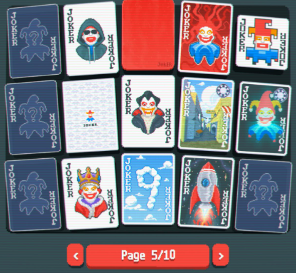
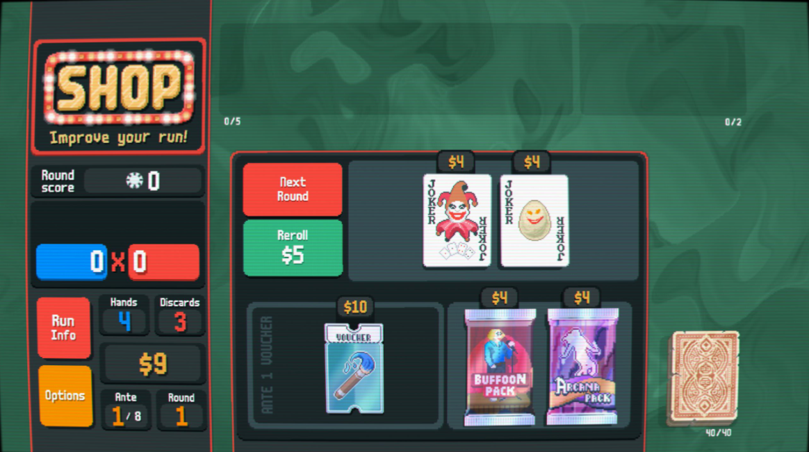

---

# 🎮 Balatro 机制分析 | Balatro Mechanics Analysis

---

## 📌 中文版

### 🧠 机制（Mechanics）

在 Balatro 中，小丑牌（Jokers）是区别于传统扑克手牌的核心机制。它们可以在击败一个盲注（Blind）后从商店购买，并且在整个游戏过程中持续生效，除非被出售。这使它们区别于一次性使用的道具，例如塔罗牌（Tarot Cards）或行星牌（Planet Cards）。

Wang（2023）指出：“游戏中技巧与随机性的组合与比例决定了不同的游戏体验”（第47页）。在 Balatro 中，扑克牌提供随机性，而小丑牌则为玩家提供发挥策略的空间。

小丑牌共有150种，每种都有不同的效果和稀有度：普通（Common）、非凡（Uncommon）、稀有（Rare）和传奇（Legendary）。稀有度越高通常意味着效果越强。有些小丑提供稳定收益，而另一些则属于高风险高回报类型。

例如，一个提升同花（Flush）得分的小丑会鼓励玩家优先构建同花，或使用塔罗牌改变花色。然而，如果玩家过度追求同花，可能会错失其他得分机会并导致失败。

这也体现了电子游戏与桌游的重要差异：电子游戏可以轻松改变卡牌大小、花色甚至赋予特殊效果，而 Balatro 充分利用了这一点。

**总结来说，玩家必须谨慎选择并组合小丑牌，以最大化其效果。**

---

此外，并非所有小丑牌一开始就可用，而是通过游戏逐步解锁。这种设计不仅鼓励玩家尝试不同策略，也延长了游戏时间。

在卡牌游戏中，玩家很容易产生“设计者在教你怎么玩”的感觉，而不是“给予你选择空间”。大量的小丑牌确保每局游戏都是独特的，并在收集过程中提供 Roguelike 式的满足感。

同时，小丑之间的联动会产生连锁反应，使得即使是低分手牌也可能打出高分。

---

### 🔁 游戏玩法（Gameplay）

“部分可控的随机性”是卡牌游戏的魅力所在。

Balatro 的核心循环围绕传统扑克展开，同时提供各种道具来降低随机性并增加决策空间。玩家需要用金钱购买道具，从而更容易获胜：

* 行星牌（Planet Cards）提升基础分数
* 凭证（Vouchers）提供全局加成
* 小丑牌（Jokers）效果最为丰富，从增加筹码到获取额外资金

获胜 → 赚钱 → 购买道具 → 再次获胜 —— 这一 Roguelike 循环让玩家通过决策而非纯运气取得胜利。

随着不断获胜，玩家获得资金购买不同道具，例如：

* 强化已有卡牌
* 增加手牌数量
* 减少牌组数量

资金数量与盲注条件迫使玩家做出最适合当前局势的选择。短期循环发生在单个盲注内，而长期循环则体现在牌组调整上。

---

总体而言，Balatro 的失败机制较为严格——如果玩家未达到最低分数，就必须从头开始。然而，每次失败通常会解锁新的小丑牌，从而在下一局提供更多组合可能。

这正是 Balatro 的重玩价值，即 Johnson（2019）所说的：“游戏中可能性广度”（第170页）。

**因此，从失败中学习并不断调整策略，也是 Balatro 长期循环的重要组成部分。**

---

### 🎯 游戏体验（Experience）

Balatro 中有超过300种道具，但新手教程却非常简短。这给玩家留下了自主探索的空间，需要不断评估自己的策略。

这种反思过程正是 Balatro 体验的核心，鼓励玩家不断尝试以追求更高分数。

持续的决策压力也是游戏体验的重要来源：

* 得分依赖概率与牌组协同
* 玩家需要权衡风险与收益
* 获得强力小丑的兴奋感
* 面对高难度盲注的紧张感

这些情绪共同构成了 Balatro 的核心体验。

因此，运气与技巧的结合，以及由此带来的情绪反馈，是游戏体验的关键组成部分。

此外，奖励系统直接激励玩家持续游玩：

当计算得分时，筹码与倍率迅速增长，分数在短时间内飙升。当数值足够大时，背后会出现火焰特效。

这种视觉反馈鼓励玩家追求更高基础分或更强的组合策略，从而持续投入游戏。

---

### 🎵 其他方面（Other Aspects）

数字时代为游戏行业带来了变革与活力，电子游戏音乐也因此发展。

Summers 指出：“音乐在游戏中可以扮演多种角色”（第6页），但它们有一个共同点：互动性。

在 Balatro 中：

* 商店页面与对局页面的音乐不同
* 主旋律会消失，仅保留和弦与鼓组
* 不同补充包对应不同音乐风格

例如：

* Buffoon Pack：音乐更诡异
* Celestial Pack：音乐更空灵

尽管所有音乐共享同一主题，小变化却显著改变氛围，引导玩家情绪。

---

另一个重要特点是 Balatro 的极简设计：

* 简短的新手教程
* 直观的 UI
* 功能清晰呈现

卡牌视觉效果增强但不会遮挡花色，使玩家更易识别与操作。

更有趣的是，游戏还设计了多种来自《巫师3》和《赛博朋克2077》的角色人头牌。

---

### 📚 参考文献（Bibliography）

Johnson, M. R. (2019). *The unpredictability of gameplay*. Bloomsbury Academic.
Summers, T. (2018). *Understanding video game music*. New York.
Wang, W. (2023). *The Structure of Game Design*. Springer Nature.

---

## 📌 English Version

### 🧠 Mechanics

In Balatro, Jokers serve as the defining mechanic that differs the game from traditional poker hands. They can be bought from the shop after defeating a Blind and remain effective throughout the entire game unless sold. This sets them apart from one-time-use items like Tarot Cards or Planet Cards.

Wang (2023) points out that “the combination and amount of skill and randomness in a game defines different playing experiences” (p.47). In Balatro, poker cards provide randomness, while Jokers create space for players to use different skills.

Jokers consists of 150 unique cards, each with different effect and rarity level: Common, Uncommon, Rare, and Legendary. Higher rarity often indicates stronger effect. Some Jokers provide stable benefits, while others are considered high-risk, high-reward choices.

For example, a Joker that increases the value of Flush hands will encourage players to prioritize finding flushes or use Tarot Cards to change card suits. However, at the same time, if players focus too much on chasing Flush hands, they may miss other scoring opportunities and fail.

This highlights a key difference between video games and board games, that video game can easily change the size, suit, or even grant special effects to a card, and Balatro takes full advantage of it.

**In conclusion, players must carefully choose and combine Jokers to maximize their impact.**

---

What’s more, not all Jokers are available at the beginning; instead, they are gradually unlocked through gameplay. This design not only encourages players to experiment with different strategies but also extends their playtime.

In a card game, players can easily feel like the designer is teaching them how to play rather than giving them opportunities to make choices. The vast number of Jokers ensures that each game is unique and provides a roguelike sense of satisfaction as players progress through the collection process.

Additionally, interactions between Jokers create various chain reactions, allowing even low-scoring hands to achieve high scores.

---

### 🔁 Gameplay

Partially controllable randomness is the charm of card games.

The core loop of Balatro revolves around traditional poker, offering various items to reduce randomness and increase opportunities for players to make decisions. Players need to use their money to buy items, which then help them win more easily.

Planet Cards increase base score; Vouchers provide global boosts; Joker Cards have the widest range, from increasing chips to acquiring additional funds.

Winning, earning funds, exchanging for items, and winning again — this roguelike loop allows players to achieve victory through their decisions rather than relying on luck.

As players continue to win, they earn money to buy different items. Items vary widely, including upgrades to existing cards, expanding hand size, and reducing the number of cards in the deck.

The amount of money and the conditions of Blinds force players to make the most suitable choices for the current situation. The short-term loop consists of actions within each Blind, while the long-term loop involves adjusting the deck.

---

Overall, failure in Balatro can be considered strict — if the player fails to reach the least score, they must start another run from the beginning. However, the end of a run often means unlocking new Jokers, allowing for different combinations in the next run.

This is the replay value of Balatro, “the breadth of possibilities that can occur in a game”(Johnson, 2019, p.170).

Conclusively, learning from failure and continuously adjusting strategies is also a part of Balatro’s long-term loop.

---

### 🎯 Experience

There are over 300 different items within Balatro, yet its tutorial for beginners is very brief. This leaves players with the opportunity to explore on their own, requiring them to constantly assess their tactics.

This process of reflection is at the heart of Balatro experience, encouraging players to keep experimenting in pursuit of higher scores.

The constant tension of decision-making is another critical factor that shapes Balatro’s game experience.

Score relies on probability and deck synergy, players need to weigh risks and rewards when using items. The excitement of finding a useful Joker, the tension of facing a overwhelming Blind, these feelings ultimately converge into the gameplay experience of Balatro.

Therefore, the combination of luck and skill, which evokes emotion, is also a core aspect of the gameplay experience in Balatro.

Finally, the game’s reward system directly provides players with the motivation to keep playing.

When calculating the score, the rapid increase of chips and multipliers cause the score to grow quickly within a short time. When this number is large enough, a flame is generated behind it.

This encourages players to seek higher base-scoring hands or use hands that can combine well with the Jokers. These direct visual feedback effectively keep players motivated.

---

### 🎵 Other Aspects

The advent of the digital era has brought both change and vitality to the game industry. Video game music has emerged to meet the demands of a vast global audience of players.

Summers indicates that “music can take various role in games” (p.6), but they all share a common feature: interactivity.

In Balatro, the music in the store page and the match page is different, with the main melody disappearing, leaving only the chords and drum kit. Additionally, opening different booster packs corresponds to different music.

When opening the Buffoon Pack, the music takes on a weird tone, while opening the Celestial Pack shifts the music to a more ethereal style. Though all the music shares a similar main theme, the small changes significantly alter the atmosphere of the game, guiding the players’ emotions.

---

Another important aspect is the minimalist design of Balatro.

From the brief beginner’s tutorial to the intuitive UI, different functions are directly presented to the player. The enhanced visual effects of the cards do not obscure the suits of the poker cards, making it easier for players to distinguish and play their cards.

What’s even more interesting is that Balatro also designs several sets of face cards with different characters from games like Wizard 3 and CyberPunk 2077.

---

### 📚 Bibliography

Johnson, M. R. (2019). *The unpredictability of gameplay*. Bloomsbury Academic.
Summers, T. (2018). *Understanding video game music*. New York.
Wang, W. (2023). *The Structure of Game Design*. Springer Nature.

---

如果你接下来想再**加一个“项目展示封面 + GIF动图 + 个人职责总结”版本（更偏校招简历风格）**，我也可以帮你再做一版更“HR友好”的README。
